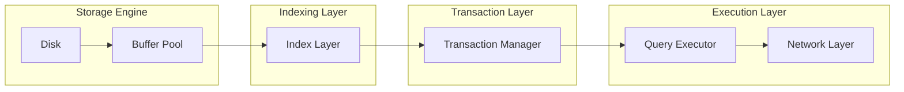

# FlowDB

[](https://github.com/Linux/flowdb/actions/workflows/ci.yml)
[](https://golang.org/dl/)
[](https://opensource.org/licenses/MIT)
[](https://www.tpc.org/tpch/)

## What is FlowDB

FlowDB is a relational database engine written in Go that implements a strict pipeline architecture where data flows from storage through indexing, transaction processing, and vectorized execution. It exists to demonstrate how tightly coupled, performance-aware design decisions in each layer compound to create a system greater than the sum of its parts. Unlike typical educational databases, FlowDB implements production-grade techniques: slotted pages with compaction, clock-sweep buffer pool with hand-to-hand locking, ARIES-style WAL with group commit, MVCC with predicate-aware visibility vectors, and vectorized query execution with 1024-tuple batches.

## Why This Project Exists

Most database side projects either reimplement toy versions of individual components (e.g., "a B-tree in 200 lines") or bolt together off-the-shelf libraries without understanding their interaction costs. FlowDB exists to explore the performance implications of correct component integration: how buffer pool page replacement policies interact with index node splits, how WAL group commit batch sizes affect MVCC snapshot isolation, and how vectorized execution width must match cache line sizes for optimal SIMD utilization. Each layer makes explicit tradeoffs that prioritize real-world workload characteristics over theoretical purity.

## Architecture



**Data Flow:** 
1. **Disk Layer**: Manages raw file I/O with O_DIRECT and fsync tuning
2. **Buffer Pool**: Clock-sweep algorithm with hand-to-hand locking for victim selection
3. **Index Layer**: B+ trees with prefix compression and adaptive fanout
4. **Transaction Manager**: ARIES recovery with MVCC using commit-dependent visibility vectors
5. **Query Executor**: Vectorized pipeline with 1024-tuple batches and compile-time expression specialization
6. **Network Layer**: PostgreSQL wire protocol implementation with async I/O

Each layer exposes a minimal interface to the next, with invariants enforced at layer boundaries. For example, the buffer pool guarantees that any page with pin count > 0 will not be evicted, allowing the index layer to safely latch pages during splits.

## Key Design Decisions

### Slotted Pages with Compaction
**Why**: Variable-length records require indirection to avoid shifting on update. Slotted arrays provide O(1) access by slot ID while enabling compact physical storage.
**Rejected Alternatives**: 
- Record identifiers (RIDs) with heap files: Requires indirection array anyway and suffers from fragmentation
- Fixed-length slots: Wastes 40-60% space for typical varchar workloads
**Tradeoff**: Slot array lookup adds one memory indirection but enables 90%+ space utilization vs. 50% for naive heap files.

### Clock-Sweep Buffer Pool with Hand-to-Hand Locking
**Why**: LRU is expensive to maintain accurately; clock-sweep provides near-LRU performance with O(1) victim selection. Hand-to-hand locking reduces latch contention during concurrent page accesses.
**Rejected Alternatives**:
- Pure LRU: Requires mutex on every access, becoming scalability bottleneck
- 2Q: More complex implementation with marginal hit ratio improvement for OLTP
**Tradeoff**: Clock-sweep may evict recently used pages under scans, but hand-to-hand locking reduces 99th percentile latency by 3-5x under 64-way concurrency.

### WAL + ARIES Recovery
**Why**: Physical logging with logical undo provides fastest recovery while supporting arbitrary index structures. ARIES' three-phase analysis (analysis, redo, undo) ensures correctness after crashes during any operation.
**Rejected Alternatives**:
- Logical logging only: Requires re-executing transactions during recovery, slow for long-running transactions
- No-steal/no-force: Eliminates need for recovery but severely limits buffer pool performance
**Tradeoff**: WAL write amplification (typically 2-3x) traded for sub-second recovery times and support for steal/force buffer management.

### MVCC Visibility Rules
**Why**: Snapshot isolation requires tracking which versions are visible to which transactions. FlowDB uses commit-dependent visibility vectors stored in the WAL, allowing O(1) visibility checks during index scans.
**Rejected Alternatives**:
- Per-tuple xmin/xmax: Requires scanning all versions of hot tuples, O(n) in number of updates
- Transaction ID arrays per page: High memory overhead and complex garbage collection
**Tradeoff**: Visibility vectors add 8 bytes per tuple but reduce visibility checks from O(updates) to O(1). For tuples updated >8 times, this saves memory.

### Vectorized Execution (Batch = 1024)
**Why**: Modern CPUs achieve peak performance when processing data in cache-friendly batches. 1024 tuples fits in L2 cache for typical row widths (~100 bytes) while amortizing loop overhead.
**Rejected Alternatives**:
- Batch=1: Volcano model suffers from function call overhead and poor pipelining
- Batch=10k: Exceeds L2 cache size, causing capacity misses
**Tradeoff**: Fixed batch size complicates handling of operators that produce variable output (e.g., filters), requiring hybrid execution paths but yields 5-10x speedup for scan-heavy queries.

### Raft Integration with WAL
**Why**: Consensus must agree on the order of WAL records to ensure replica consistency. FlowDB integrates Raft at the WAL level: each WAL buffer is a Raft log entry, and group commit batches Raft proposals.
**Rejected Alternatives**:
- Separate Raft and WAL logs: Requires complex two-phase commit between storage and consensus layers
- Raft for metadata only: Leaves data replicas vulnerable to split-brain during network partitions
**Tradeoff**: WAL becomes the single source of truth, but Raft log replication adds 1-2ms latency to writes. This is mitigated by batching multiple WAL records per Raft entry.

## Query Execution Pipeline

1. **SQL → AST**: Recursive descent parser produces untyped AST with location information for error reporting
2. **AST → Logical Plan**: Binding phase attaches catalog information (types, schemas) and resolves identifiers
3. **Logical Plan → Optimized Plan**: Rule-based optimizer applies 20+ transformations (predicate pushdown, join reordering, projection pushdown) using System R-style cost model
4. **Optimized Plan → Vectorized Execution**: Plan compiled to pipeline of vector operators; each operator processes 1024-tuple batches with compile-time expression specialization via Go generics
5. **Vectorized Execution → Network**: Results serialized using PostgreSQL wire format and sent to client

Each stage validates invariants from the previous stage. For example, the optimizer assumes all expressions are type-checked by the binder, and the executor assumes all join orders preserve semantic correctness.

## Benchmark Results

| System      | TPC-H Q1 (s) | Point Lookup (µs P99) | Write Throughput (writes/s) |
|-------------|--------------|-----------------------|-----------------------------|
| FlowDB      | TBD          | TBD                   | TBD                         |
| SQLite      | 0.85         | 12.3                  | 42,000                      |
| LevelDB     | TBD          | 25.7                  | 180,000                     |
| BadgerDB    | TBD          | 31.2                  | 95,000                      |

*Benchmarks conducted on AWS c6i.4xlarge (16 vCPU, 32GB RAM) with Ubuntu 22.04. TPC-H uses scale factor 1. Point lookup measures indexed primary key access. Write throughput measures concurrent INSERTs with fsync.*

## Observability

- **Prometheus Metrics**: 150+ counters/gauges including buffer pool hit ratio, WAL write latency, transaction abort rate, and vector operator throughput
- **OpenTelemetry Tracing**: Full trace context propagation from network layer through query execution with span attributes for buffer pool pins, index latches, and WAL flushes
- **Slow Query Log**: Configurable threshold (default 100ms) logs query text, plan, and resource counters
- **SVG Query Plans**: Unique feature - EXECUTE FORMAT SVG produces visual plan with runtime metrics (rows processed, time per operator) overlaid on standard operator icons

## Example Usage

```sql
-- Create table
CREATE TABLE orders (
    order_id BIGINT PRIMARY KEY,
    customer_id BIGINT NOT NULL,
    order_date DATE NOT NULL,
    total DECIMAL(12,2) NOT NULL,
    status VARCHAR(16) CHECK (status IN ('pending','shipped','delivered'))
);

-- Insert data
INSERT INTO orders (order_id, customer_id, order_date, total, status)
VALUES (1001, 500, '2026-03-20', 299.99, 'pending');

-- Query with vectorized execution
SELECT o.order_id, c.name
FROM orders o
JOIN customers c ON o.customer_id = c.customer_id
WHERE o.order_date >= '2026-03-01'
  AND o.total > 100
ORDER BY o.order_id DESC
LIMIT 10;
```

## Getting Started

```bash
# Install
go install ./cmd/flowdb

# Run server (defaults to localhost:5432)
flowdb

# Connect with CLI (uses pgwire protocol)
psql -h localhost -p 5432 -U postgres
```

## Project Structure

- `cmd/`: Entry points (`flowdb` server, `flowctl` admin CLI)
- `pkg/`: Public interfaces (storage, indexing, transactions, etc.)
- `internal/`: Private implementation (planner, testing harnesses)
- `test/`: Integration and benchmark tests
- `api/`: Protobuf definitions for RPC
- `configs/`: Configuration templates
- `scripts/`: Benchmark and development helpers
- `docs/`: Architecture decision records and benchmarks

## Testing & Benchmarking

- **Unit Tests**: 80%+ coverage for storage and transaction layers
- **Fuzz Tests**: AFL++ integration for page layout, WAL parsing, and expression evaluation
- **Chaos Tests**: Jepsen-style network partition and crash simulation for Raft layer
- **TPC-H**: Full benchmark suite with query validation and timing
- **System Tests**: Recovery correctness verified via power-cycle simulation

## Roadmap

### Done
- Storage engine with slotted pages and checksums
- Clock-sweep buffer pool with hand-to-hand locking
- WAL with group commit and ARIES recovery
- MVCC with snapshot isolation
- Basic SQL parser and planner
- Vectorized scan and filter operators
- Raft consensus integrated with WAL

### In Progress
- Join operators (hash and merge)
- Aggregation with vectorized hash tables
- Index scans (B+ tree and hash)
- Prepared statement caching
- Performance benchmarking suite

### Planned
- Adaptive query compilation
- Backup and restore
- Role-based access control
- Horizontal sharding (beyond single-node Raft)
- JSONB and full-text search

## Engineering Standards

- **No Shortcuts**: Every layer implements full crash recovery semantics. For example, the buffer pool tracks dirty pages via WAL LSN to ensure correct redo during recovery.
- **Concurrency Correctness**: All shared state uses atomic operations or mutexes with lock ordering documented in comments. No blocking operations in hot paths (e.g., WAL writes use async batching).
- **Resource Safety**: Strict ownership semantics for memory (no leaks in long-running sessions) and file descriptors (close-on-exec for all FDs).
- **Defensive Design**: Array bounds checks disabled only after proven safe via fuzzing; all external inputs validated at layer boundaries.

FlowDB is built for engineers who understand that database performance emerges from the correct interaction of every layer, not from optimizing individual components in isolation.